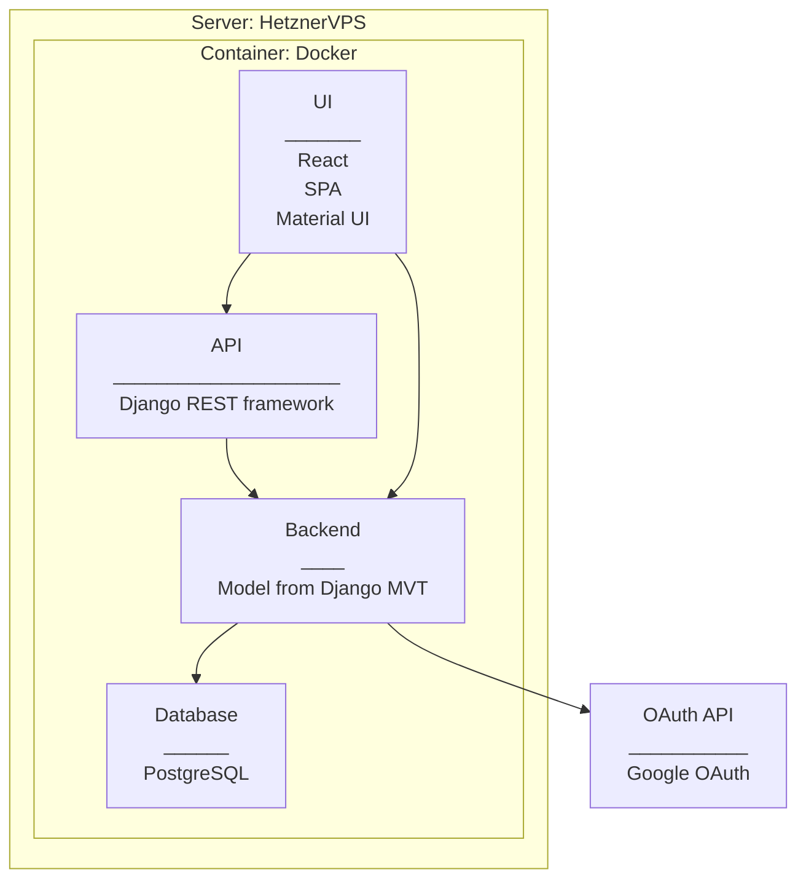

# Application Architecture

## Overview

**Server**

- Hetzner VPS

**Container**

- Docker container

**UI**

- React Application
  - Single Page Application design style
  - Material UI: React Component library for styling web content

**API**

- API: Django REST framework

**Backend**

- Django: Python web framework
  - Implement Model from Django MVT

**Database**

- PostgreSQL

**Authentication (OAuth)**

- Google OAuth: OAuth 2.0 protocol

## Initial proposal for API-routes

- all/
- consult/name
- certs/?certification=cert1,cert2, cert3
- skills/?skill=skill1,skill2,skill3
- startdate/

Other notes

- Certifications and Skills from Database through API?
