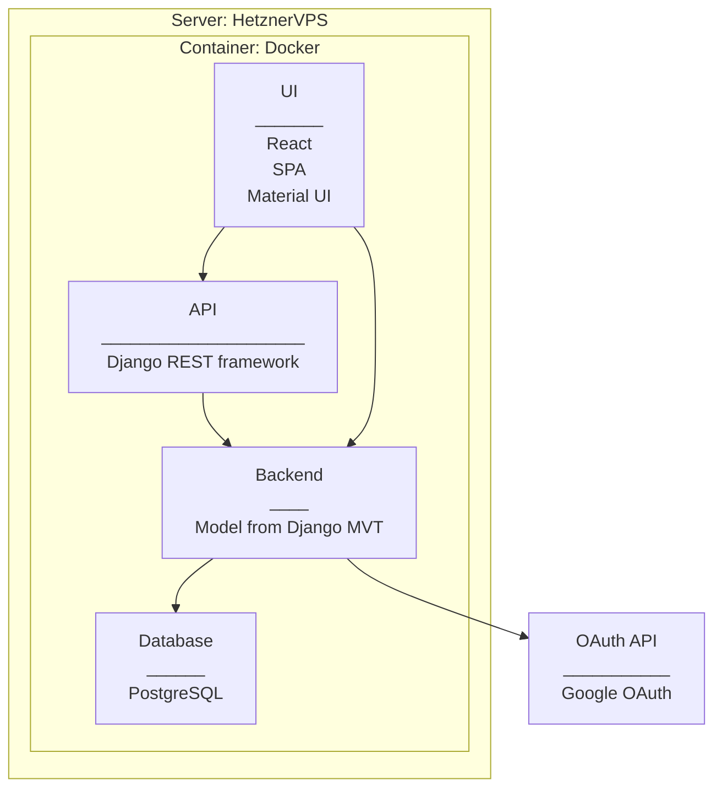

# Application Architecture

## Overview

## Notes

React

- Single Page Application
- Material UI

REST-API
An initial proposal for API-routes:

- all/
- consult/name
- certs/?certification=cert1,cert2, cert3
- skills/?skill=skill1,skill2,skill3
- startdate/

Other notes

- Certifications and Skills from Database through API?
