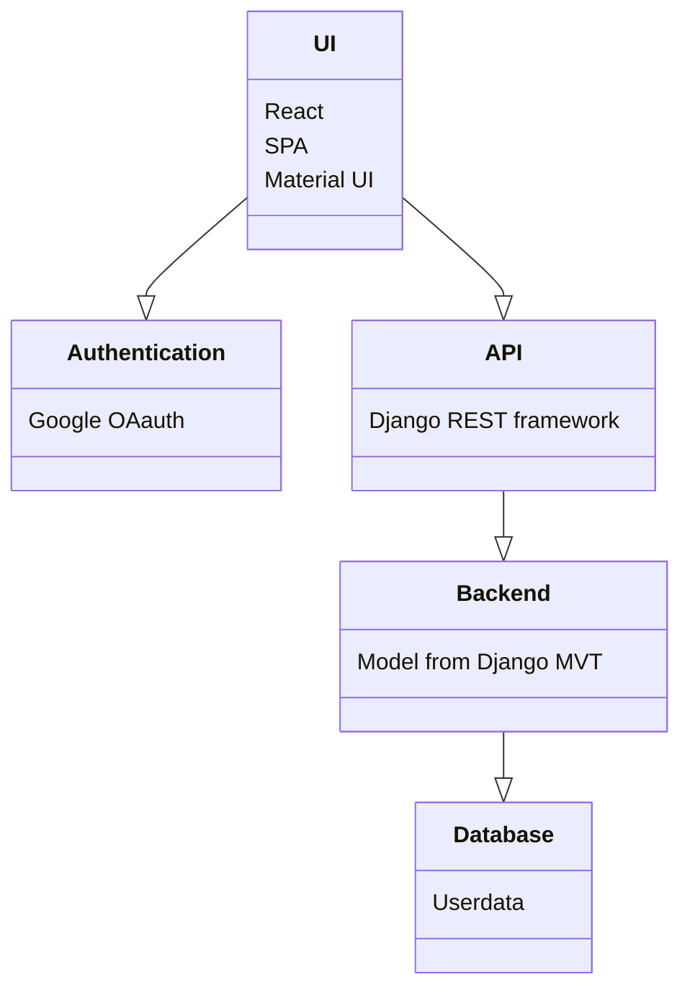

## Notes

React

- Single Page Applicatoin
- Material UI

REST-API

- all/
- consult/name
- certs/?certification=cert1,cert2, cert3
- skills/?skill=skill1,skill2,skill3
- startdate/

Other notes

- Certifications and Skills from Database through API?
