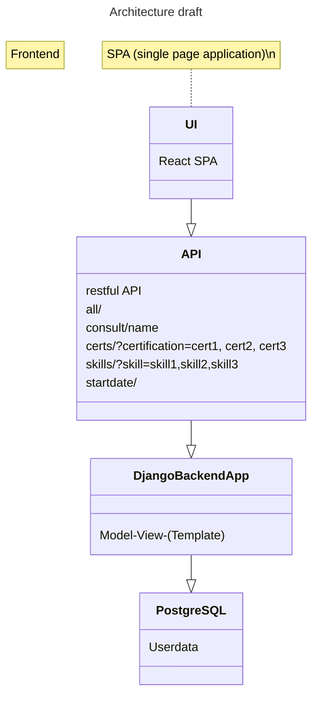

```mermaid
---
title: Architecture draft
---
classDiagram
    UI --|> API
    note "Frontend"
    API --|> DjangoBackendApp
    DjangoBackendApp --|> PostgreSQL
    note for UI "SPA (single page application)\n"
    class UI {
        React SPA
    }
    class API {
        restful API
        all/
        consult/name
        certs/?certification=cert1, cert2, cert3
        skills/?skill=skill1,skill2,skill3
        startdate/
    }
    class DjangoBackendApp {
        Model-View-(Template)
    }
    class PostgreSQL {
        Userdata
    }
```
